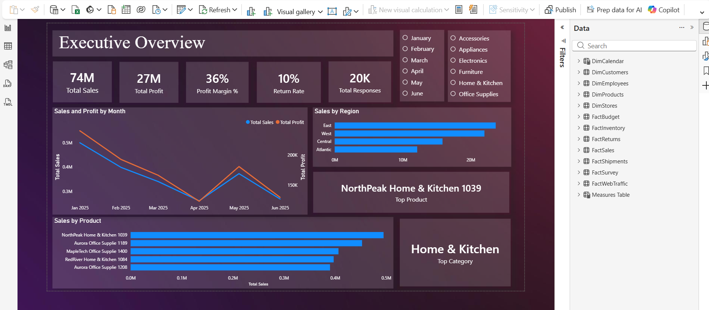
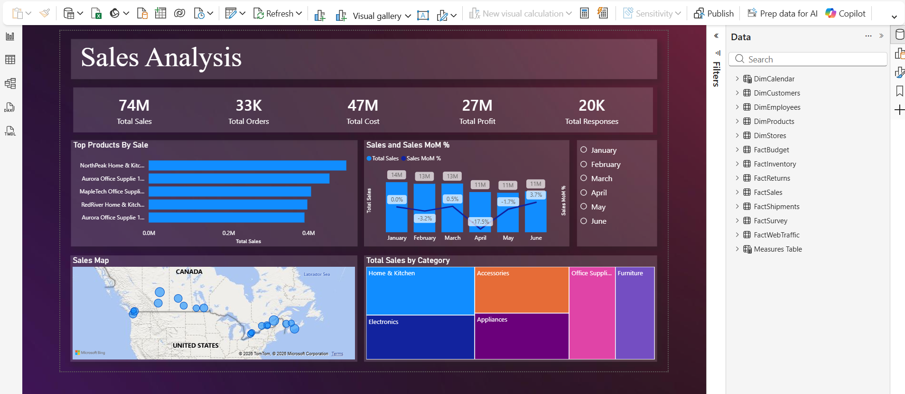
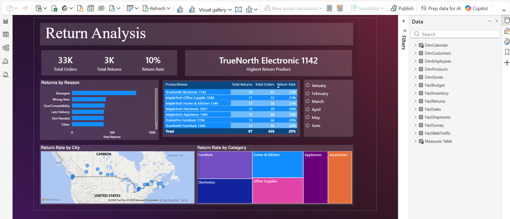
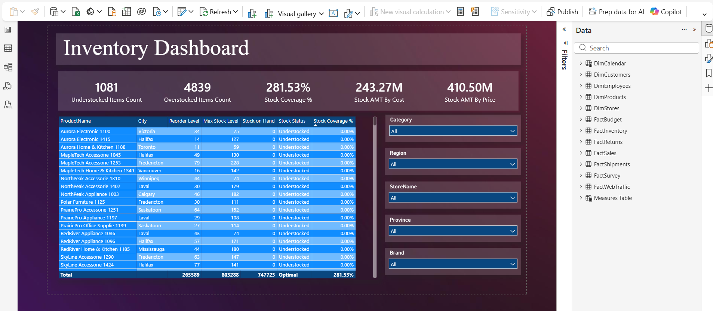
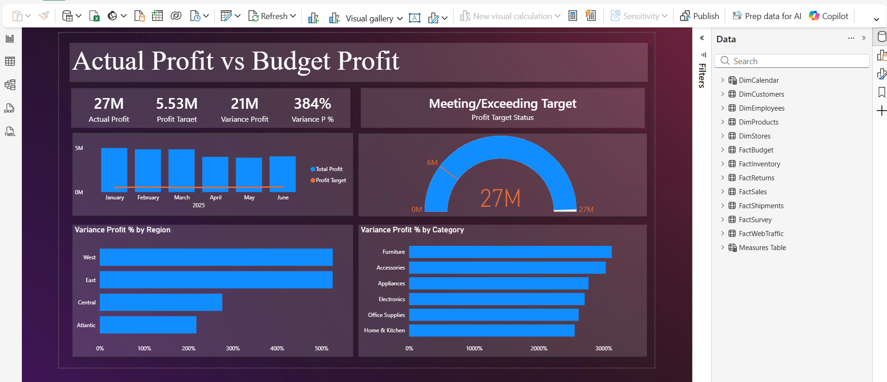

# SkyMart Power BI Dashboard

A complete Business Intelligence dashboard created in **Power BI Desktop** using **Power Query** for data cleaning and **DAX** for calculations. This project combines data from multiple Excel and CSV files into a single interactive dashboard to help analyse business performance.


---

## 📌 Project Overview

SkyMart collects data from various sources, including sales, returns, inventory, shipments, customer surveys, and website traffic. Since the data comes from separate files, it needs to be cleaned, organised, and connected before it can be analysed.

This dashboard brings all that information together into one report, making it easier to track performance and support business decisions.

---

## ❓ Business Questions

| # | Question                                                     | Dashboard Page                     |
| - | ------------------------------------------------------------ | ---------------------------------- |
| 1 | How are sales and profit changing over time?                 | Executive Overview, Sales Analysis |
| 2 | Which products, stores, and regions generate the most sales? | Sales Analysis, Sales Drilldown    |
| 3 | Which products have the highest return rates?                | Returns Analysis                   |
| 4 | Which products are overstocked or running low?               | Inventory Dashboard                |
| 5 | Are deliveries arriving on time?                             | Shipment Operations                |
| 6 | How satisfied are customers across different regions?        | Customer Satisfaction              |
| 7 | Is actual performance meeting the budget?                    | Budget vs Actual                   |

---

## 📊 Dashboard Pages

### 1. Executive Overview



This page provides a quick summary of the company's performance, including total sales, total profit, return rate, and on-time delivery percentage. It gives users a clear overview of the business in one place.

### 2. Sales Analysis



Shows monthly sales and profit trends, making it easy to identify increases or decreases over time. It also highlights the best-performing regions, stores, and product categories.

### 3. Returns Analysis



Displays return rates by category and brand, along with the most common return reasons and product conditions. This helps identify products that may need quality improvements.

### 4. Inventory Dashboard



Tracks inventory levels and identifies products that are overstocked, understocked, or at normal stock levels. This helps improve inventory planning and reduce unnecessary costs.


### 6. Budget vs Actual



Compares actual profit with planned budget values, making it easy to see where business performance exceeded or fell below expectations.


---

## 🔑 Key Insights

* Sales and profit changed throughout the reporting period, with some months performing better than others.
* The East region generated the highest revenue among all regions.
* Home & Kitchen was one of the strongest product categories.
* Furniture recorded the highest return rate compared to other categories.
* A large number of products were identified as overstocked, while some required restocking.
* Most shipments were delivered on time with consistent delivery performance.
* Customer satisfaction remained high across all regions.
* Actual profit performed better than the planned budget during the reporting period.

---

## 🛠️ Tools & Skills Used

* **Power BI Desktop**
* **Power Query** for cleaning and transforming data
* **DAX** for creating measures and calculations
* **Data Modeling** using a star schema
* Data relationships and filtering
* Interactive dashboards with slicers and navigation
* KPI cards, charts, tables, and conditional formatting

---

## 📁 Project Structure

```text
Sky-Mart-PowerBI-Dashboard/
├── skymart_project.pbix
├── README.md
├── screenshots/
└── DAX_measures.md
```

---

## 🚀 Getting Started

Download the **Power BI** project file and open it in **Power BI Desktop** to explore the dashboard.

📊 **[Power BI Dashboard (skymart_project.pbix)](skymart_project.pbix)**


## 📄 License

This project is shared for learning and portfolio purposes. Feel free to use the structure and ideas as inspiration for your own Power BI projects.
